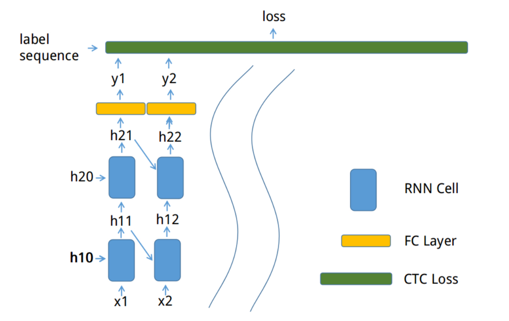
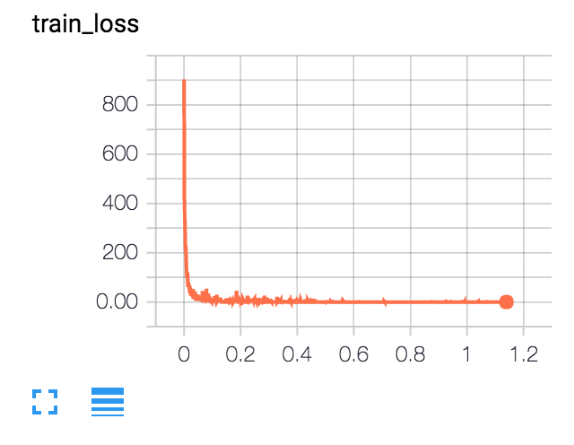
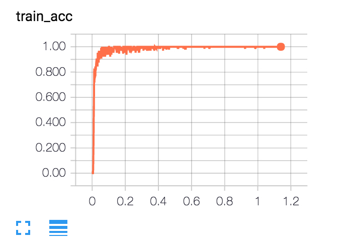
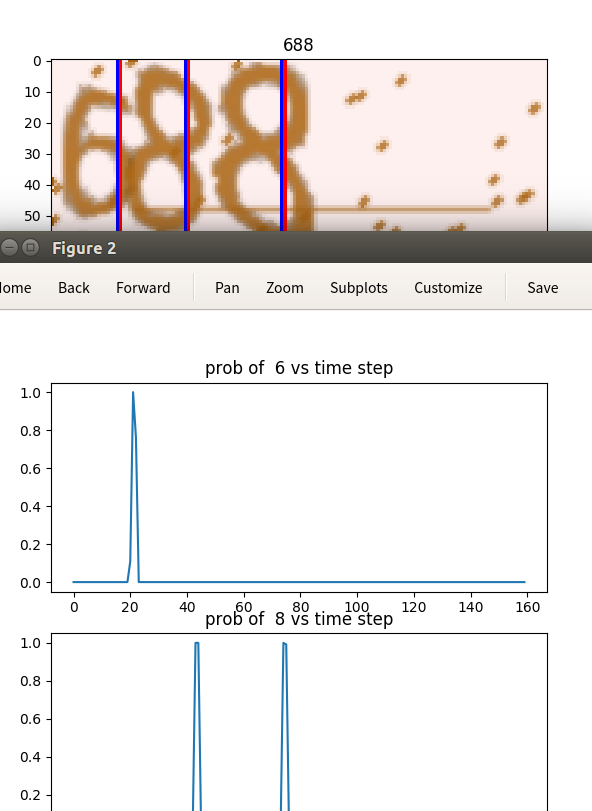

## Captcha Recognition
This repo is a demo for how to use warpctc in PyTorch to recognize captcha in images.

### Warpctc PyTorch Binding

[Baidu's warpctc project](https://github.com/baidu-research/warp-ctc) is a famous library to compute CTC loss. It's writen by C++11, which makes it easy to bind warpctc with other deep learning framework, such as MXNet and PyTorch.

There is a [warpctc binding for Caffe](https://github.com/xmfbit/warpctc-caffe). Here, we use [warpctc binding for PyTorch](https://github.com/SeanNaren/warp-ctc).

### Generate Data

The python package [captcha](https://pypi.python.org/pypi/captcha/0.1.1) is used to generate dataset for training and testing.

You can use `python generate_captcha.py` to generate the captcha images. The default data folder is `$PROJECT_DIR/data`. If you want to specific another one, you need to modify the variable `DATASET_PATH` in `utils.py`.

### Train

The neural network is a stacked LSTM. See `model.py` for detail.


To train the model, run the following command:
```
python main.py
```

If [tensorboard](https://github.com/dmlc/tensorboard) has been installed, a logging event file will be generated in the folder `$PROJECT_DIR/log`, which can be used to visualize the training process using `tensorboard` command of TensorFlow.

Here are the results I got. The training loss:


The training accuracy:


The testing accuracy:


During the training process, it will save checkpoint every 10 epochs. The default folder to save the checkpoints is `$PROJECT_DIR/pretrained`

### Test

When the training is done, you can check the trained model using this command:
```
python test.py test_image_path trained_model_path
```

The output are two figures, showing the probabilities of different digits vs column.

